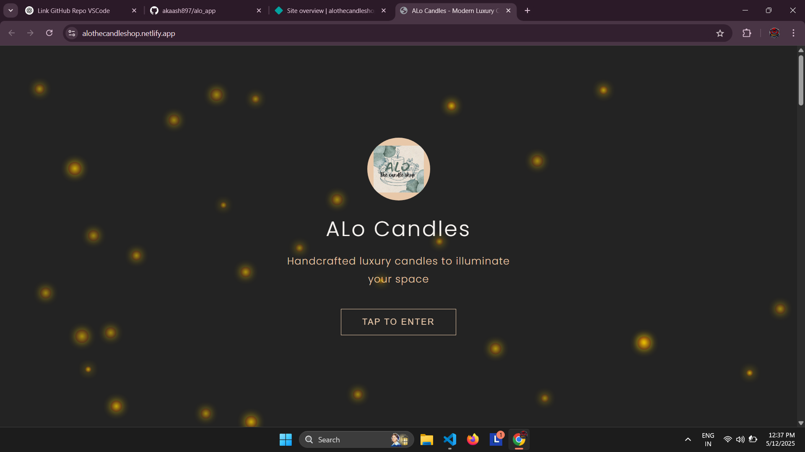

# 🕯️ Alo Candles — Handcrafted Modern Luxury

Welcome to **Alo Candles**, a beautifully designed handcrafted candle shop website that brings the essence of modern luxury and natural wellness into every home. Inspired by traditional Indian aromatherapy, the website delivers a refined digital experience that mirrors the warmth and elegance of its physical products.

## 🌟 Project Overview

This project showcases a fully responsive and interactive landing page for **Alo Candles**, featuring:

- Animated entrance experience  
- Smooth navigation and mobile-friendly design  
- Elegant hero and about sections  
- Interactive carousel of luxury candles  
- Founder spotlight with a personal story  
- Product modal popups  
- Instagram-inspired behind-the-scenes section  
- Customer testimonials slider  
- Contact form with company information  
- Visually rich footer with quick links  

Whether you're a front-end developer, designer, or small business owner, this template serves as a creative foundation for elegant product-based websites.

---

## 📸 Preview

  
*Replace with a screenshot of your homepage.*

---

## 🔧 Technologies Used

- **HTML5** – Semantic structure and accessibility  
- **CSS3** – Responsive styling and animations  
- **JavaScript (ES6)** – Carousel, modal logic, animations  
- **Google Fonts** – Poppins for a modern look  
- **Font Awesome** – Icons for social media and interaction  
- **Responsive Design** – Optimized for mobile, tablet, and desktop  

---

## 🚀 Features

| Feature                     | Description                                                                 |
|----------------------------|-----------------------------------------------------------------------------|
| ✨ Entrance Overlay         | Eye-catching entry animation with brand logo and "Tap to Enter"            |
| 🧑‍🎨 About & Founder Sections | Storytelling approach to brand identity and mission                       |
| 🕯️ Product Carousel         | Scrollable candle collection with tags (Romantic, Luxury, etc.)            |
| 💬 Testimonials             | Slider with real customer reviews                                          |
| 📱 Mobile Menu              | Hamburger menu for smaller screens                                         |
| 📷 Instagram Reel Section   | Preview area to link to Instagram or showcase behind-the-scenes content    |
| 📩 Contact Form             | Basic inquiry form with email, phone, and address details                  |
| 🦶 Footer Navigation        | Brand description, quick links, policies, and social icons                 |

---

## 📂 Folder Structure

ALo-Candles/
├── index.html
├── style.css
├── images


---

## 💡 How to Use

1. Clone this repository:
   ```bash
   git clone https://github.com/akaash897/alo_app
2. Open index.html in your browser.

3. Customize content, images, and styles as needed.

4. Deploy using GitHub Pages, Netlify, Vercel, or your preferred platform.

---

## Contact
Created by Akaash Chatterjee (akaash897@gmail.com) — feel free to reach out!

---

## 📝 License
This project is licensed under the MIT License.


